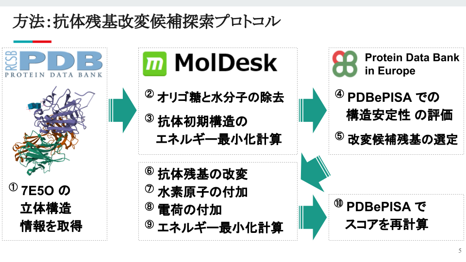

# NT-193
Author: rei-ashine<br>
DATE: Oct. 10th, 2023<br>
UPDATE: Oct. 26th, 2023<br>

---
Scripts for
01. Formatting a PDB file<br>
USAGE: `bash 01_format_pdb_files.sh &>> logs/formatting.log`<br>
[NOTE]: Before running the shell script,<br>
you should do `cp config.sample config` and change the path<br>
to the directory containing the pdb files you want to format.

---
## Installing Dependencies
All dependencies can be installed with conda.<br>
An environment screenshot is provided :
```bash
conda env create -f environment.yml
```
Once the environment is created,<br>
it can be used at any time (without having to download everything again) :
```bash
conda activate nt-193
```
Exit the running virtual environment :
```bash
conda deactivate
```
Delete the virtual environment :
```bash
conda remove -n nt-193 --all
```

## Setting up Jupyter Notebook
Add a virtual environment to the kernel of Jupyter Notebook :
```bash
ipython kernel install --user --name nt-193
```
Confirm that "nt-193" is included in "Available kernels" :
```bash
jupyter kernelspec list
```

---
## Antibody Residue Modification Protocol

